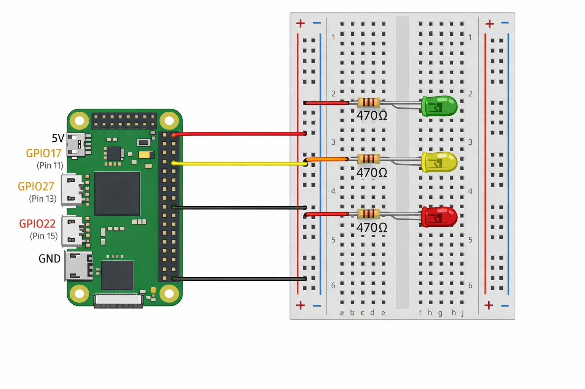

# real-time-stock-alert-system
## Overview
This project is a Raspberry Pie-based system status hub that uses LEDs to indicate the functioning of different services running on the Pi.
Each LED represents a subsystem amd turns off if it detects a malfunction in that service. The LEDs all blink in a specific sequence.

## LED Status Mapping
| GPIO Pin | LED Color | System Monitored | Behavior |
|--------|----------|------------------|----------|
| GPIO17 (Pin 11) | Purple | Core System | ON = Pi running, OFF = Pi down |
| GPIO22 (Pin 15) | Yellow | Stock Monitor | ON = service running, OFF = service down |
| GPIO27 (Pin 13) | Orange | Weather Service | ON = service running, OFF = service down |

## Hardware
- Raspberry Pi Zero 2 W
- Breadboard
- 3x LEDs (Purple, Orange, Yellow)
- 3x 470Ω resistors
- Jumper Wires
- 5v power supply
- GPIO pins are set HIGH when their corresponding system is running  
- GPIO pins are set LOW when a system or service is down  
- LEDs provide immediate visual feedback for system health  

## Wiring
- Each LED anode (+) connects to its GPIO pin through a 470Ω resistor.
- All LED cathodes (-) share a common GND rail connected to Pi GND.
- Pi 5V (Pin 4) connected to red power rail.
- Pi GND (Pin 6) connected to blue ground rail.

## Software Logic
- GPIO pins are set HIGH when their corresponding system is running.  
- GPIO pins are set LOW when a system or service is down.
- LEDs provide immediate visual feedback for system health.

## Example
- **Purple LED** (GPIO17) → ON when Pi is running well, OFF when Pi is down.  
- **Yellow LED** (GPIO22) → ON when stock monitoring system is active, OFF if the service fails.  
- **Orange LED** (GPIO27) → ON when weather system is running, OFF if down.

## Future Expansion
- Integrate real-time stock price monitoring. 
- Add weather API monitoring. 
- Add buzzer or other alert systems. 
- Expand to more LEDs or relays for additional system monitoring.
- Optional web dashboard for remote system status.

## Notes
- Resistors can be placed in any orientation — current-limiting value is the important part. 
- All LED cathodes can share a single GND rail.
- GPIO pins can be adjusted as needed; ensure you do not use pins reserved for power or GND.

